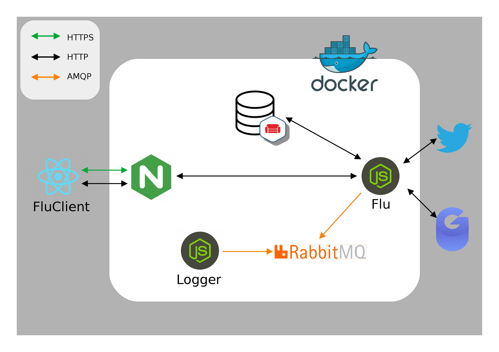

# flu

Progetto Reti di Calcolatori

## Cosa è "Flu" ?
"Flu" è un progetto ideato per misurare l'**influenza** di un dato individuo nel contesto dei social media e della rete in genere. 
<br />
Lo svolgimento dell'analisi è basato sulla costruzione di un **indicatore composito** formulato sui dati raccolti tramite API offerte dai servizi esterni di Twitter e gNews.


## Tecnologie
- **NodeJs**
- **CouchDB**
- **RabbitMQ**


## Architettura

Il server di backend gira interamente in un ambiente Docker, che oltre a gestire i singoli container offre un servizio di DNS, che permette il load balancing delle repliche dell' application server.
- **Nginx**: l'access point del server backend è il container Nginx che funge da reverse proxy e implementa i protocolli http e https.
- **RabbitMQ e Logger**: la gestione dei log dell'application server (Flu) è demandata a RabbitMQ e al Logger che, tramite comunicazioni asincrone basate sul protocollo amqp.
- **Flu**: Flu ricopre il ruolo dell'application server che gestisce ed elabora le risorse dinamiche ottenute interrogando le API REST di Twitter (OAuth2) e gNews.
Inoltre Flu espone delle API REST proprie per visualizzare i risultati delle elaborazioni e per sottomettere nuove ricerche.  
- **CouchDB**: CouchDB è l'elemento che offre la persistenza delle informazioni generate da Flu ed è interrogato tramite API REST. 




## Prerequisiti
### Lato API:
- **Docker**
- **Docker compose**

### Lato Client:
- **React**
- **Node JS**
- **npm**

## Installazione
### Lato API:

Per installare ed eseguire "Flu" è sufficiente posizionarsi con la shell all'interno della directory principale della repository ed eseguire il seguente comando:

```
docker-compose up
```

Per generare più istanze docker dell' application server, eseguire invece il seguente comando, sostuendo "n" con un intero indicante il numero di istanze desiderate: 

```
docker-compose up --scale flu=n
```
### Lato Client:

Per installare ed eseguire "FluClient" è sufficiente posizionarsi con la shell all'interno della directory
<br />
./FluClient/flu-client della repository ed eseguire il seguente comando:

```
npm start
```

## Uso
### Lato API:
Nel caso in cui l'utente decida di testare Flu senza l'ausilio del Client, è possibile trovare la documentazione delle API esposte nel percorso ./apidoc/index.html .

### Lato Client:
Il Client react fornisce la possibilità di usufruire dei servizi di Flu all'indirizzo


